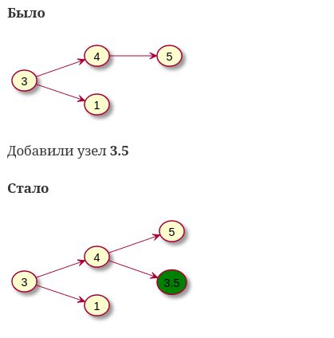
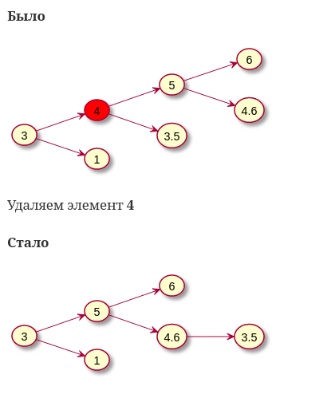
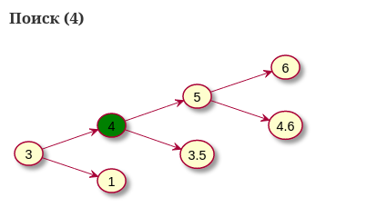
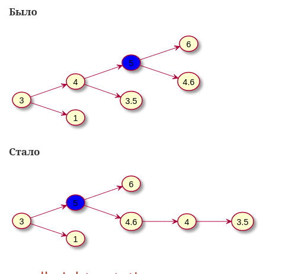
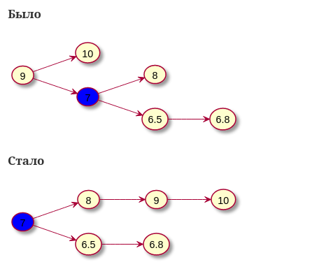
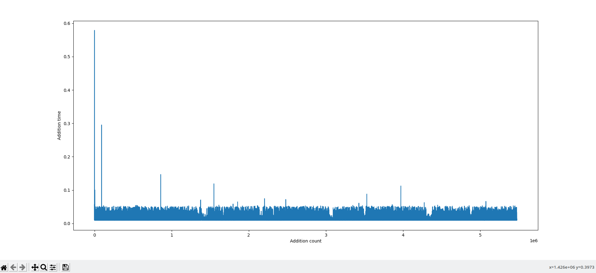
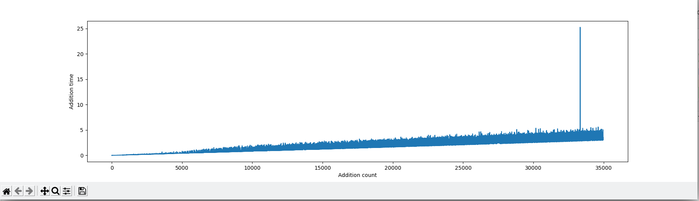

= Бинарное дерево

== Реализация дерева

Данная лабораторная работа содержит бинарное дерево,
в котором реализованы следующие методв

* add(value: float) - Вставка элемента в дерево
* remove(value: float) - Удаление элемента из дерева
* search(value: float): bool - Содержит ли дерево элоемент
* search_r(value: Float): TreeNode - Возвращает узел дерева, в котором содержится
необходимый элемент, либо _None_
* small_right_rotate(node: TreeNode) - Поворот дерева вправо относительно заданного узла
* small_left_rotate(node: TreeNode) - Поворот дерева влево относительно заданного узла

=== add
Добавляет элемепнт *value* не баллансируя дерево

*Было*
[plantuml, format="svg"]
----
@startuml
left to right direction
(3) --> (4)
(3) --> (1)
(4) --> (5)
@enduml
----

Добавили узел  *3.5*

*Стало*
[plantuml, format="svg"]
----
@startuml
left to right direction
(3) --> (4)
(3) --> (1)
(4) --> (5)
(4) --> (3.5)
(3.5)#green
@enduml
----

=== remove

Удаляет элемент со значением value
Причем *successor* - большая ветка удаленного элемента становится меньшей веткой родительского элемента *root*,
который был удален
Меньшая ветка удаленного элемента попадает в наименьшую сторону большей ветки

*Было*
[plantuml, format="svg"]
----
@startuml
left to right direction
(3) --> (4)
(3) --> (1)
(4) --> (5)
(4) --> (3.5)
(5) --> (6)
(5) --> (4.6)
(4) #red
@enduml
----

Удаляем элемент *4*

*Стало*
[plantuml, format="svg"]
----
@startuml
left to right direction
(3) --> (5)
(3) --> (1)
(5) --> (6)
(5) --> (4.6)
(4.6) --> (3.5)
@enduml
----

=== search

Выводит, содержится ли значение *value* в дереве

Возвращает *True* или *False*

=== search_r
Рекурсивный поиск узла дерева с заданным значением
Возвращает *TreeNode* - узел дерева с заданным значением

*Поиск (4)*

[plantuml, format="svg"]
----
@startuml
left to right direction
(3) --> (4)
(3) --> (1)
(4) --> (5)
(4) --> (3.5)
(5) --> (6)
(5) --> (4.6)
(4)#green
@enduml
----

=== small_left_rotate

*node* - узел вращения
Родительский элемент передвигается вниз к наименьшему дочернему элементу

*Было*

[plantuml, format="svg"]
----
@startuml
left to right direction
(3) --> (4)
(3) --> (1)
(4) --> (5)
(4) --> (3.5)
(5) --> (6)
(5) --> (4.6)
(5)#blue
@enduml
----

*Стало*

[plantuml, format="svg"]
----
@startuml
left to right direction
(3) --> (5)
(3) --> (1)
(4) --> (3.5)
(5) --> (6)
(5) --> (4.6)
(4.6) --> (4)
(5)#blue
@enduml
----

=== small_right_rotation

*node* - узел вращения
Родительский элемент передвигается вниз к наибольшему дочернему элементу

*Было*

[plantuml, format="svg"]
----
@startuml
left to right direction
(9) --> (10)
(9) --> (7)
(7) --> (8)
(7) --> (6.5)
(6.5) --> (6.8)
(7)#blue
@enduml
----

*Стало*

[plantuml, format="svg"]
----
@startuml
left to right direction
(7) --> (8)
(7) --> (6.5)
(6.5) --> (6.8)
(8) --> (9)
(9) --> (10)
(7)#blue
@enduml
----

== Тестирование производительности алгоритма

=== Дерево с случайными числами

==== Заполнение

В течении *1 минуты*
Было добавлено *5 474 924* элементов

===== График добавыления по времени

==== Поиск

_n / 10_ чисел занял: ** 2145.0758 ms**

==== Удаление
_n / 10_ чисел занял: ** 1049.1979 ms**

=== Дерево, заполненное числами по возрастанию

==== Заполнение
В течении *1 минуты*
Было добавлено *35 000* элементов

===== График заполнения по вроемеени

==== Поиск
Проблемой поиска оказалась его рекурсивность, из-за которой при поиске в несбаланситрованном дереве
пришлось увеличивать лимит рекурсивных вызовов. Можно переделать в будущем

_n / 10_ чисел занял: ** 422.4319 ms**

==== Удаление
_n / 10_ чисел занял: ** 13.9773 ms**

'''

Тестирование производилось на машине

* CPU: I5 9600k 4.1 Ghz
* RAM 32 GB